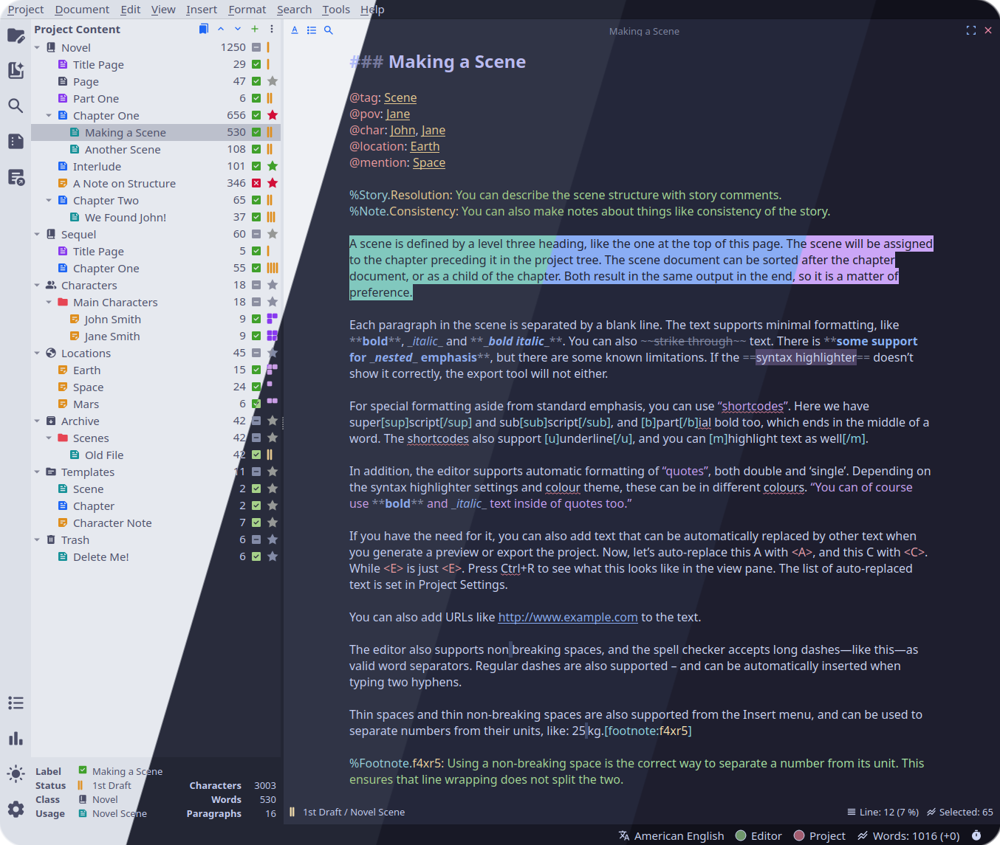
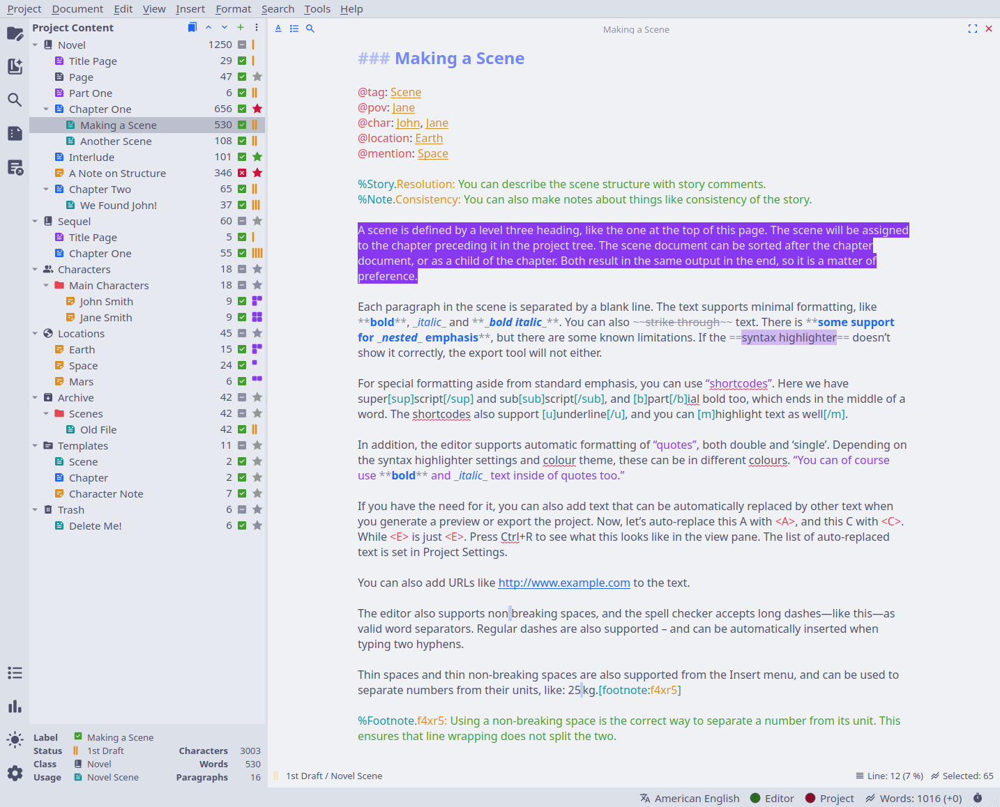
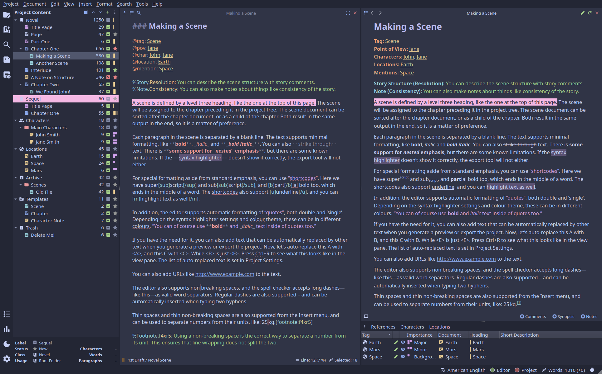
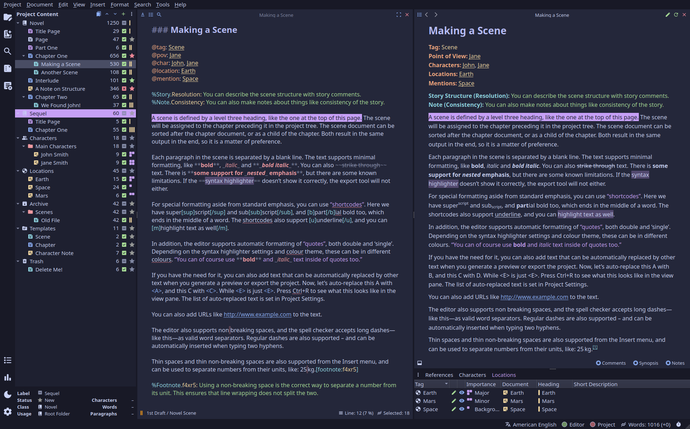
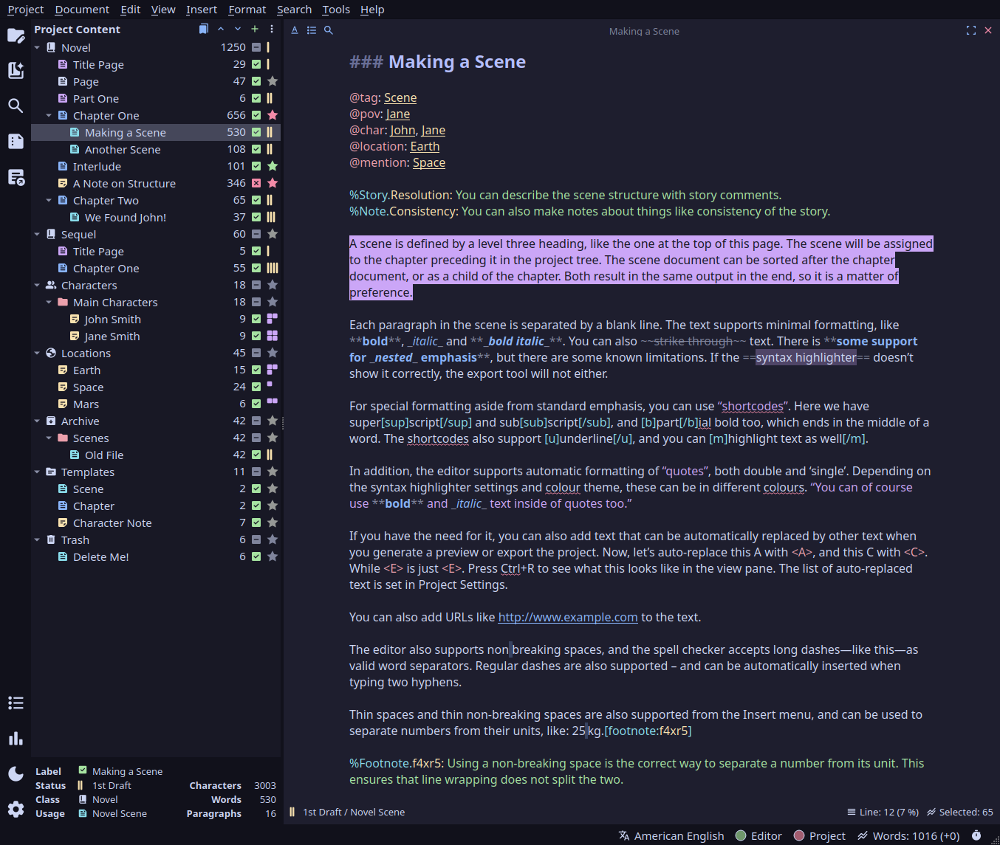

<h3 align="center">
	 
	
	Catppuccin for <a href="https://github.com/vkbo/novelWriter">novelWriter</a>
	
</h3>

	
	
	

	

## Previews

🌻 Latte

🪴 Frappé

🌺 Macchiato

🌿 Mocha

## Usage

1. Download the flavor of your choice.
2. Save the file to your local novelWriter themes folder. See also the [novelWriter documentation](https://novelwriter.io/docs/technical/locations.html#application-data).
The standard paths are:
    - Linux: `~/.local/share/novelwriter/themes/`
    - MacOS: `~/Library/Application Support/novelwriter/themes/`
    - Windows: `C:\Users\<USER>\AppData\Roaming\novelwriter\themes\`  
   
2. Restart the novelWriter application.
3. Go to **Tools** > **Preferences**.
4. Change the **Light colour theme** and/or **Dark colour theme**.

<!-- The FAQ section is optional. Remove if needed.
## 🙋 FAQ

- Q: **_"How can I do X?"_**\
  A: ...
-->
## 💝 Thanks to

- [Myian](https://github.com/HeyMyian)
- [vkbo](https://github.com/vkbo)

&nbsp;

	

	Copyright &copy; 2021-present <a href="https://github.com/catppuccin" target="_blank">Catppuccin Org</a>

	

