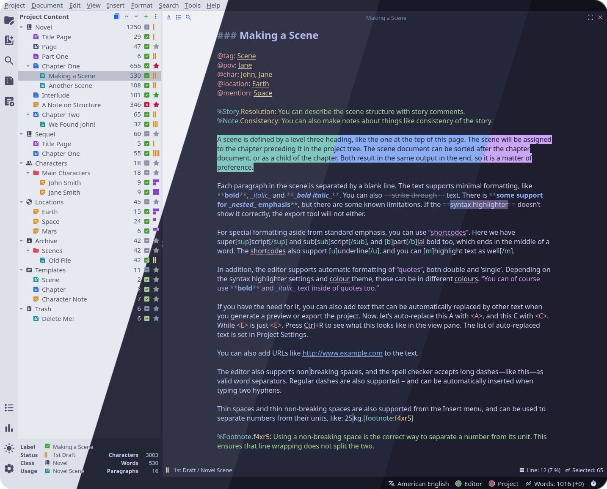
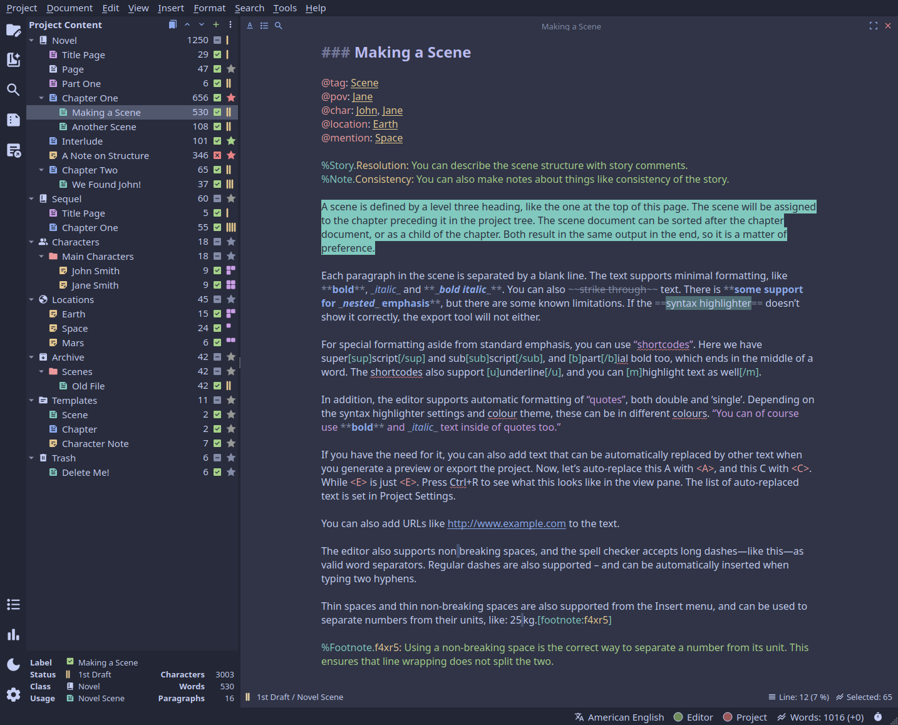
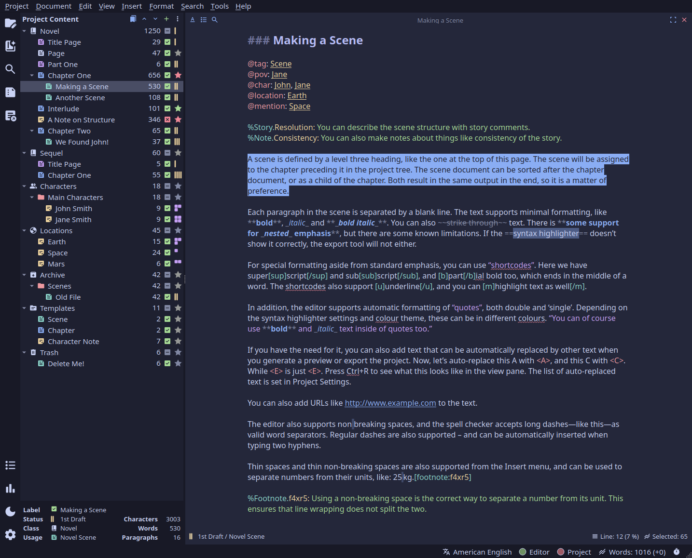
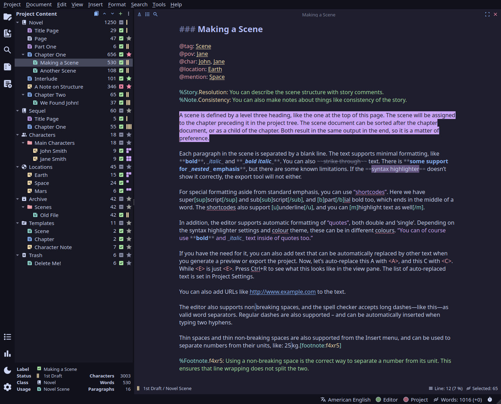

<h3 align="center">
	 
	
	Catppuccin for <a href="https://github.com/vkbo/novelWriter">novelWriter</a>
	
</h3>

	
	
	

	

## Previews

🌻 Latte

🪴 Frappé

🌺 Macchiato

🌿 Mocha

## Variations

The normal accent variations change only the color of selections. All have *mauve* dialog color.

In the `dialog` variations, the accent color determines the color of selections as well as dialog. All other syntax highlighting colors are cycled around to maintain contrast.

## Usage

1. Download the file with the flavor and accent of your choice.
2. Save the file to your local novelWriter themes folder. See also the [novelWriter documentation](https://novelwriter.io/docs/technical/locations.html#application-data).
The standard paths are:
    - Linux: `~/.local/share/novelwriter/themes/`
    - MacOS: `~/Library/Application Support/novelwriter/themes/`
    - Windows: `C:\Users\<USER>\AppData\Roaming\novelwriter\themes\`  
   
2. Restart the novelWriter application.
3. In novelWriter, go to **Tools** > **Preferences** (default hotkey <kbd>Ctrl</kbd> + <kbd>,</kbd>)
4. Change the **Light color theme** and/or **Dark color theme**.

## Notes

- These themes are for novelWriter 2.8 and later only.
- The **Latte Mauve** and **Mocha Mauve** flavors are already included in the novelWriter application.

## 💝 Thanks to

- [Myian](https://github.com/HeyMyian)
- [vkbo](https://github.com/vkbo)

&nbsp;

	

	Copyright &copy; 2021-present <a href="https://github.com/catppuccin" target="_blank">Catppuccin Org</a>

	

